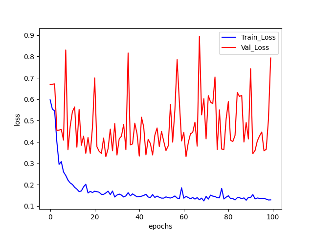

# Chest-Classification program
***Author***: Shiwei Liu, [College of Artificial Intelligence, Nankai University](https://aien.nankai.edu.cn/)

***E-mail***: 2011832@mail.nankai.edu.cn

## About this program
This project is my final assignment for the course "Artificial Intelligence Technology" during my junior year at Nankai University.It is used to classify whether a given human lung X-ray image is diseased or not. I built a CNN by Pytorch to deal with this problem and it works well in this [dataset](https://drive.google.com/file/d/15DMIblTJiV5QB8pdA7L0bccnXL7gBAg7/view?usp=sharing) (please download it in```./chest_xray```). After only 100 epochs training, it achieves 88% accuracy in validation dataset and 75% accuracy in test dataset. I also plot the "**train and val loss**" curve and test-results images.

## Requirements
1. Create a [conda](https://www.anaconda.com) environment by running this command(replace YOUR_ENV_NAME):
    ```
    conda create -n YOUR_ENV_NAME python==3.9 
    ```
2. Install [Pytorch](https://pytorch.org/) which is suitable for your GPU or CPU(not recommended):
    ```
    pip3 install torch torchvision torchaudio --index-url https://download.pytorch.org/whl/cu118
    ```
3. Use ```pip``` tool to install other required package:
    ```
    pip install numpy
    pip install os
    pip install matplotlib
    ```

## Run this program
1. Clone this project to your own PC:
    ```
    git clone 
    ```
2. Download [dataset](https://drive.google.com/file/d/15DMIblTJiV5QB8pdA7L0bccnXL7gBAg7/view?usp=sharing), and place file ```chest_xray``` in ```./Chest_Classify```
3. Activate the conda environment created before ```conda activate YOUR_ENV_NAME``` and run this command (replace NUM_OF_EP):
    ```
    python main.py --epochs=NUM_OF_EP
    ```
    Trained module will be saved as ```./model.pt```.
## Result
When ```main.py``` finished the train function I use matplotlib to plot the curve of "train loss/accuracy" and "validation loss/accuracy":



You can write your own ```test.py``` to visualize the training result.

## Further discussion
The overfitting situation is very serious. Maybe more dropout or a simpler network structure?
